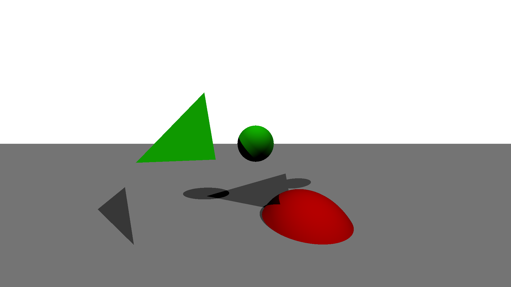

# Simple Raytracer in Racket
This is a simple ray tracer written in racket for a university programming class.
The intention was not to write a very efficient, top-of-the-line rendering program,
but instead work out by myself most of the standard ray-tracing techniques and
the features of racket.

## What it does
* Rendering of simple primitives
  * Spheres
  * Planes
  * Triangles
* Shadows using shadow rays
* It uses rackets class features, although it is way slower that using plain structs

## Whot is does not
* There is currently no gamma-correction
* There is no support for loading in meshes
* Use multiple threads to speed everything up

## What might be done in the future
* I might be adding reflection and refraction to the shader
* Possibly texture support
  * A skybox might be nice as well

## License
Copyright © 2017 Daniel Albert <git+racket-raytracer@esclear.de>  
This work is free. You can redistribute it and/or modify it under the
terms of the Do What The Fuck You Want To Public License, Version 2,
as published by Sam Hocevar. See the COPYING file for more details.
